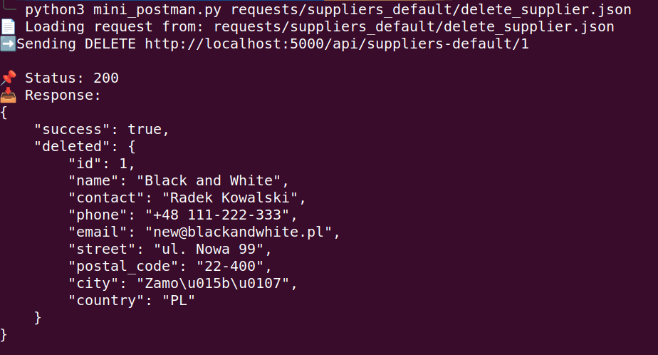
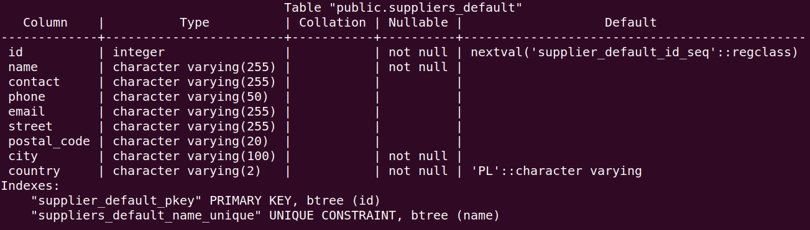

# Smart Inventory AI – Backend


Backend API for inventory management system built with Node.js, Express, and PostgreSQL.

## 🎯 Project Goal

The goal of this project is to build a scalable backend system for inventory management,
focusing on clean architecture, validation, and real-world API design.

This project simulates real-world backend development practices used in production systems.

---

## 🚀 Features

- Full CRUD for suppliers (default + user-based)
- Input validation and normalization (phone, country, etc.)
- RESTful API design
- Error handling (400 / 404 / 409 / 500)
- PostgreSQL integration with parameterized queries
- Modular structure (controllers / routes / validators)

---

## 🛠 Tech Stack

- Node.js
- Express.js
- PostgreSQL
- JavaScript (ES Modules)

---

## 🧱 Architecture

The project follows a modular backend structure:

- **controllers/** → business logic (CRUD operations)
- **routes/** → API endpoints
- **utils/validators/** → validation & normalization
- **db.js** → database connection

### Flow:

Request → Route → Controller → Validation → Database → Response

---

## 📡 API Endpoints

### Suppliers Default

| Method | Endpoint                   | Description       |
| ------ | -------------------------- | ----------------- |
| GET    | /api/suppliers-default     | Get all suppliers |
| POST   | /api/suppliers-default     | Create supplier   |
| PUT    | /api/suppliers-default/:id | Update supplier   |
| DELETE | /api/suppliers-default/:id | Delete supplier   |

---

## 📥 Example Request

### Create Supplier

```json
{
  "name": "Example Supplier",
  "contact": "John Doe",
  "email": "example@mail.com",
  "phone": "111222333",
  "street": "Main 1",
  "postal_code": "00-000",
  "city": "Warsaw",
  "country": "PL"
}
```

---

## 🔄 Data Processing

- Phone numbers are normalized (e.g. `111222333 → +48 111-222-333`)
- Input is validated before database operations
- Errors are returned with proper HTTP status codes

---

## 🗄 Database

PostgreSQL database required.

### suppliers_default

| Column      | Type       | Description             |
| ----------- | ---------- | ----------------------- |
| id          | integer    | Primary key             |
| name        | varchar    | Supplier name (unique)  |
| contact     | varchar    | Contact person          |
| email       | varchar    | Email address           |
| phone       | varchar    | Normalized phone number |
| street      | varchar    | Street address          |
| postal_code | varchar    | Postal code             |
| city        | varchar    | City                    |
| country     | varchar(2) | ISO country code        |

---

## ⚙️ Environment Variables

Create `.env` file:

```env
DB_USER=postgres
DB_HOST=localhost
DB_NAME=inventory_ai
DB_PASSWORD=yourpassword
DB_PORT=5432
```

---

## 🌱 Seed Data

You can load initial data:

```bash
psql -U postgres -d inventory_ai < seeds/suppliers_default.sql
```

---

## 📸 Screenshots




---

## 🧪 Running the Project

```bash
npm install
npm run dev
```

---

## 🌱 Future Improvements

- Authentication (JWT)
- User-based suppliers (multi-tenant)
- Pagination & filtering
- Swagger / OpenAPI documentation
- Docker support
- Frontend integration (React)

---

## 👨‍💻 Author

Marcin Czapla
Backend Developer (Node.js | PostgreSQL | REST API)

---

## 📌 Status

🚧 In progress – actively developed
